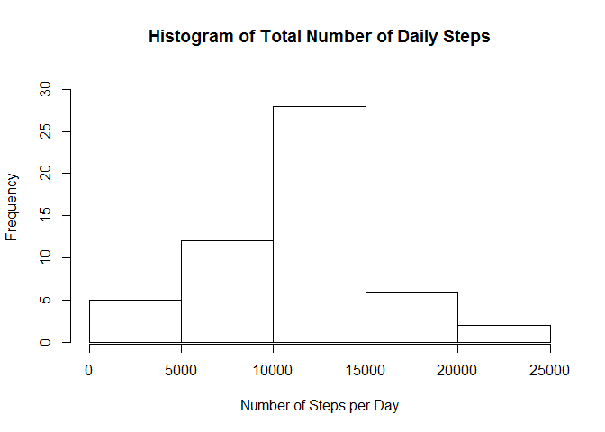
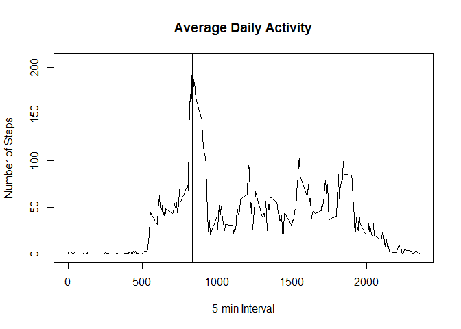
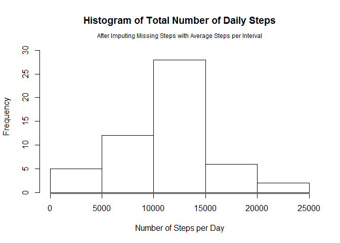
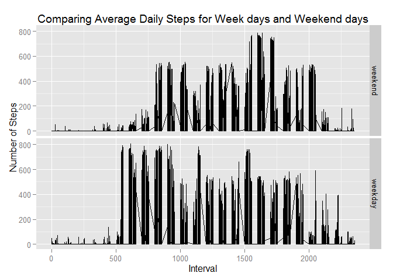

# Reproducible Research: Peer Assessment 1


## Loading and preprocessing the data

```r
    # Unzip the data file and load into dataframe called 'activity'
    unzip("activity.zip", exdir=".", overwrite=TRUE)
    activity <- read.csv("activity.csv", 
                         na.strings="NA", 
                         stringsAsFactors=F,
                         colClasses=c("numeric", "Date", "numeric"))
```

Let us review the characteristics of data frame:

```r
    str(activity)
```

```
## 'data.frame':	17568 obs. of  3 variables:
##  $ steps   : num  NA NA NA NA NA NA NA NA NA NA ...
##  $ date    : Date, format: "2012-10-01" "2012-10-01" ...
##  $ interval: num  0 5 10 15 20 25 30 35 40 45 ...
```

## What is mean total number of steps taken per day?

```r
    # Identify the observations that do not have any missing values
    good <- complete.cases(activity)
    
    # Calculate the Total Steps per Day using dplyr's 'group_by()' 
    # and 'summarise_each()'
    byDate <- activity[good,] %>% group_by(date)
    sumByDate <- byDate %>% summarise_each(funs(sum), steps)
    
    # 6-point summary of Total Steps per day
    summary(sumByDate)
```

```
##       date                steps      
##  Min.   :2012-10-02   Min.   :   41  
##  1st Qu.:2012-10-16   1st Qu.: 8841  
##  Median :2012-10-29   Median :10765  
##  Mean   :2012-10-30   Mean   :10766  
##  3rd Qu.:2012-11-16   3rd Qu.:13294  
##  Max.   :2012-11-29   Max.   :21194
```

```r
    # Plot a Histogram to show the Mean total Steps per day
    hist(sumByDate$steps, main="Histogram of Total Number of Daily Steps",
         xlab="Number of Steps per Day", ylim=c(1,31))
```

 

```r
    # Mean:
    mean.steps <- mean(sumByDate$steps)
```

   Mean Total Daily Steps: *10766*  

```r
    # Median: 
    median.steps <- median(sumByDate$steps)
```

   Median Total Daily Steps: *10765*

## What is the average daily activity pattern?

```r
    # Calculate the Mean Steps per 5-min Interval
    byInterval <- activity[good,] %>% group_by(interval)
    meanByInterval <- byInterval %>% summarise_each(funs(mean), steps)

    # Generate a line graph showing the Average Daily Activity 
    plot(x=meanByInterval$interval, y=meanByInterval$steps, type="l",
         main = "Average Daily Activity", 
         xlab="5-min Interval",
         ylab="Number of Steps")

    # Calculate the Maximum Average Steps by sorting the data with the
    # largest value at the top.
    indx <- order(meanByInterval$steps, decreasing=T)
    abline(v=meanByInterval[indx[1],]$interval)
```

 

Interval with Maximum Average: *835*  
  
## Imputing missing values

So far the data analysis has ignored observations that have missing values.  
The total number of rows with missing information: *2304*

Ignoring these observations may have an impact on the analysis so far. To 
investigate the impact we need to impute the missing steps.  

**Strategy**:  
I will use the simple strategy of taking the average steps for any interval 
that has a missing step and imputing the average value as the missing value. 

For example if a particular interval has a missing value, and its average value 
for observations with non-missing steps is '2', then the interval will use '2' 
as its number of steps.


```r
    # Merge the Average Steps per Interval to the Activity data frame. 
    # The common field is the interval, so this is used for the join
    ActivityMean <- merge(activity, meanByInterval, by="interval", all.x=TRUE)
    
    # Identify the Observations with missing Steps.
    good <- complete.cases(ActivityMean)

    # Update the *missing* Step value with the Average Step for that interval    
    ActivityMean[!good,]$steps.x = ActivityMean[!good,]$steps.y
    
    # Rename steps.x to steps and drop steps.y
    newActivity <- select(ActivityMean, interval, steps = steps.x, date)
    
    # Calculate the Total Steps per day using all the observations, including
    # imputed values
    newByDate <- newActivity %>% group_by(date)
    newSumByDate <- byDate %>% summarise_each(funs(sum), steps)

    # Plot a Histogram to show the Mean total Steps per day
    hist(newSumByDate$steps, main="Histogram of Total Number of Daily Steps",
         xlab="Number of Steps per Day",
         ylim=c(1,31))
    mtext("After Imputing Missing Steps with Average Steps per Interval", 
          line=0, side=3, cex=.75)
```

 

```r
    #Mean:
    mean.steps2<- mean(newSumByDate$steps)
   
    #Median:  
    median.steps2 <- median(newSumByDate$steps)
```
Mean Total Steps with imputed values: *10766*  
Median Total steps with imputed values: *10765*  
  
Difference in mean:*0*  
Difference in median:*0*  


## Are there differences in activity patterns between weekdays and weekends?

```r
# Use weekdays() to identify the weekday from the date field
newActivity$dayofweek = ifelse(weekdays(newActivity$date,TRUE) %in% c("Sun","Sat"),0,1)

# Create a factor field to indicate whether a day is weekday or weekend
newActivity$daytype = factor(newActivity$dayofweek, labels=c("weekend","weekday"))

# Group by interval
byInterval <- newActivity %>% group_by(interval)
meanByInterval <- byInterval %>% summarise_each(funs(mean), steps)

# Generate Panel plot showing diff b/n weekday and weekend
qplot(interval, y=steps, data = newActivity,
      geom="line",
      facets=daytype ~ .,
      xlab="Interval",
      ylab="Number of Steps",
      main="Comparing Average Daily Steps for Week days and Weekend days")
```

 
